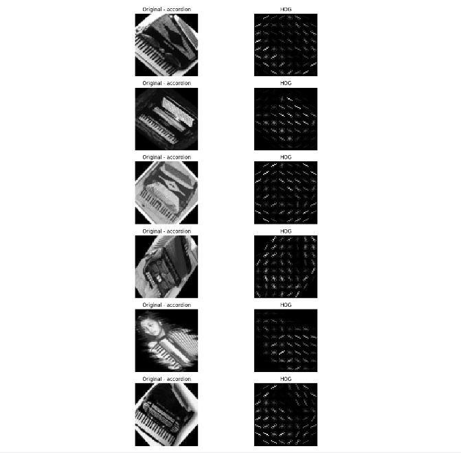

# Caltech101 Image Classification Using HOG Features and SVM

## Project Overview

This project implements an image classification system for the
Caltech101 dataset using classical computer vision and machine learning
methods.

The main goal is to classify objects from 101 categories using:

-   Histogram of Oriented Gradients (HOG) for feature extraction
-   Support Vector Machine (SVM) for classification
-   GridSearchCV for hyperparameter optimization
-   PCA for feature space visualization

The complete pipeline:

    Caltech101 Dataset
            |
            V
    Image Preprocessing
            |
            V
    Grayscale Conversion
            |
            V
    Resize to 64x64
            |
            V
    HOG Feature Extraction
            |
            V
    Feature Standardization
            |
            V
    SVM Training
            |
            V
    GridSearchCV Optimization
            |
            V
    Classification Evaluation
            |
            V
    PCA Visualization

# Dataset

The experiments were performed using the Caltech101 Object Categories
dataset.

The class `BACKGROUND_Google` was removed.

Final dataset:

  Parameter                 Value
  ------------------- -----------
  Number of classes           101
  Number of images           8677
  Image size              64 × 64
  Image type            Grayscale

# Image Preprocessing

Each image was processed using the following steps:

1.  RGB images were converted into grayscale images.
2.  All images were resized to 64×64 pixels.
3.  Images were converted into numerical arrays.

Result:

    Images shape:
    (8677, 64, 64)

# HOG Feature Extraction

Histogram of Oriented Gradients (HOG) was used to extract shape and edge
information.

Parameters:

    orientations = 9
    pixels_per_cell = (8,8)
    cells_per_block = (2,2)
    block_norm = L2-Hys

Feature extraction results:

    HOG features shape:
    (8677, 1764)

    HOG images shape:
    (8677, 64, 64)

Example HOG visualization:

# Train and Test Split

The dataset was divided using an 80/20 stratified split.

Training data:

    (6941, 1764)

Testing data:

    (1736, 1764)

# Feature Standardization

StandardScaler was applied before SVM training.

Results:

    Mean:
    -1.5032679904848832e-17

    Std:
    1.0000000000000004

# SVM Classification

Support Vector Machine was used as the classifier.

The following parameters were optimized:

    C:
    [0.01, 0.1, 1]

    Gamma:
    ['scale', 0.01, 0.1]

    Kernel:
    ['linear', 'rbf']

GridSearchCV evaluated:

    18 configurations × 3 folds = 54 fits

# Best SVM Model

The best model obtained:

    SVC(C=0.01, kernel='linear')

Best parameters:

    C = 0.01
    Gamma = scale
    Kernel = linear

# Experimental Results

## Accuracy Results

Cross-validation accuracy:

    65.69 %

Final test accuracy:

    67.57 %

Number of support vectors:

    5665

Classification result:

# PCA Visualization

The original HOG feature vector contains 1764 dimensions.

PCA was applied to reduce the feature space to three dimensions.

Original dimension:

    1764

PCA output:

    (6941,3)

Explained variance ratio:

    [
    0.05189807,
    0.04325328,
    0.02750935
    ]

Total explained variance:

    12.27 %

3D PCA visualization:

# SVM Decision Region Visualization

A 3D grid was generated in PCA space.

Number of grid points:

    3375

Converted back to HOG space:

    (3375,1764)

The trained SVM successfully predicted the class of all generated
points.

# Final Results Summary

  Parameter              Result
  -------------------- --------
  Images                   8677
  Classes                   101
  Feature extraction        HOG
  Feature dimension        1764
  Training samples         6941
  Testing samples          1736
  Best kernel            Linear
  Best C                   0.01
  CV Accuracy            65.69%
  Test Accuracy          67.57%
  Support vectors          5665
  PCA dimension               3
  PCA variance           12.27%

# Limitations

-   Background objects affect some classifications.
-   Color information was removed.
-   Fixed image size may remove image details.
-   Only limited SVM parameters were tested.

# Future Improvements

Possible improvements:

-   Background removal before HOG extraction
-   Object segmentation
-   Data augmentation
-   Combining HOG with other descriptors
-   Comparison with CNN based methods

# Project Structure

    Caltech101-HOG-SVM/

    │
    ├── README.md
    │
    ├── Caltech101_SVM.ipynb
    │
    └── results/
        |
        ├── svm_result.png
        ├── hog_visualization.png
        └── pca_3d.png

# Conclusion

This project demonstrates that HOG features combined with SVM can
provide an effective classical machine learning solution for Caltech101
object classification.

The final model achieved:

    Test Accuracy = 67.57%

on 101 object categories.

The results show that handcrafted features can still provide meaningful
performance for image classification tasks while remaining interpretable
and computationally efficient.
