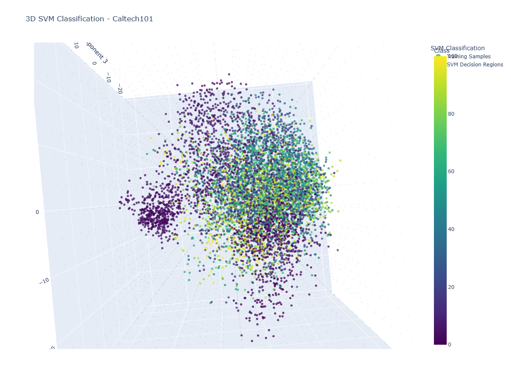

# Caltech101 Image Classification Using HOG Features and SVM

## Project Overview

This project implements an image classification system for the
Caltech101 dataset using classical computer vision and machine learning
methods.

The main objective is to classify objects from 101 categories using
Histogram of Oriented Gradients (HOG) feature extraction and Support
Vector Machine (SVM) classification.

The complete pipeline:

    Caltech101 Dataset
            |
            V
    Image Preprocessing
            |
            V
    Grayscale Conversion
            |
            V
    Resize Images to 64x64
            |
            V
    HOG Feature Extraction
            |
            V
    Feature Standardization
            |
            V
    SVM Training
            |
            V
    GridSearchCV Optimization
            |
            V
    Performance Evaluation
            |
            V
    PCA Visualization

# Dataset

The experiments were performed using the Caltech101 Object Categories
dataset.

The class `BACKGROUND_Google` was removed because it does not represent
a specific object category.

Final dataset information:

  Parameter                    Value
  ---------------------- -----------
  Number of classes              101
  Number of images              8677
  Image size                 64 × 64
  Image representation     Grayscale

# Image Preprocessing

Each input image was processed using the following steps:

1.  Conversion from RGB to grayscale.
2.  Resizing all images to 64×64 pixels.
3.  Conversion of images into numerical arrays.

Result:

    Images shape:
    (8677, 64, 64)

# HOG Feature Extraction

Histogram of Oriented Gradients (HOG) was used to extract edge and shape
information from images.

HOG parameters:

    orientations = 9
    pixels_per_cell = (8,8)
    cells_per_block = (2,2)
    block_norm = L2-Hys

Feature extraction results:

    HOG features shape:
    (8677, 1764)

    HOG images shape:
    (8677, 64, 64)

# Train and Test Split

The dataset was divided using an 80/20 stratified split.

Training samples:

    (6941, 1764)

Testing samples:

    (1736, 1764)

# Feature Standardization

Before training the SVM classifier, HOG features were standardized using
StandardScaler.

Results:

    Mean:
    -1.5032679904848832e-17

    Std:
    1.0000000000000004

# SVM Classification

Support Vector Machine was used as the final classifier.

GridSearchCV was applied to find the optimal SVM parameters.

Search space:

    C:
    [0.01, 0.1, 1]

    Gamma:
    ['scale', 0.01, 0.1]

    Kernel:
    ['linear', 'rbf']

GridSearchCV evaluation:

    18 configurations × 3 folds = 54 fits

# Best SVM Model

The best obtained model:

    SVC(C=0.01, kernel='linear')

Best parameters:

    C = 0.01
    Gamma = scale
    Kernel = linear

# Experimental Results

Cross-validation accuracy:

    65.69%

Final test accuracy:

    67.57%

Number of support vectors:

    5665

# PCA and SVM Visualization

The original HOG feature vector contains 1764 dimensions.

PCA was applied to reduce the feature space into three dimensions for
visualization.

Original feature dimension:

    1764

PCA output:

    (6941, 3)

Explained variance ratio:

    [
    0.05189807,
    0.04325328,
    0.02750935
    ]

Total explained variance:

    12.27%

A three-dimensional grid was generated in PCA space and classified using
the trained SVM model.

Number of grid points:

    3375

Converted grid size in original HOG space:

    (3375, 1764)

The following figure shows the training samples and SVM decision regions
in the PCA-reduced feature space.

# Final Results Summary

  Parameter                  Result
  -------------------- ------------
  Dataset                Caltech101
  Number of classes             101
  Number of images             8677
  Feature extraction            HOG
  Feature dimension            1764
  Training samples             6941
  Testing samples              1736
  Best kernel                Linear
  Best C                       0.01
  CV Accuracy                65.69%
  Test Accuracy              67.57%
  Support vectors              5665
  PCA dimension                   3
  PCA variance               12.27%

# Limitations

-   Background information affects some image classifications.
-   Color information was removed during preprocessing.
-   Resizing images to 64×64 may remove fine details.
-   Only limited SVM parameters were evaluated.

# Future Improvements

Possible improvements:

-   Background removal before feature extraction.
-   Object segmentation.
-   Data augmentation.
-   Combining HOG with other image descriptors.
-   Comparison with CNN and transfer learning approaches.

# Project Structure

    Caltech101-HOG-SVM/

    │
    ├── README.md
    │
    ├── Caltech101_SVM.ipynb
    │
    └── results/
        |
        └── svm_pca_visualization.png

# Conclusion

This project demonstrates a complete classical machine learning pipeline
for Caltech101 object classification.

Using HOG feature extraction and SVM classification, the final model
achieved:

    Test Accuracy = 67.57%

on 101 object categories.

The results demonstrate that handcrafted image features combined with
machine learning methods can still provide meaningful classification
performance while maintaining interpretability and lower computational
complexity compared with deep learning approaches.
